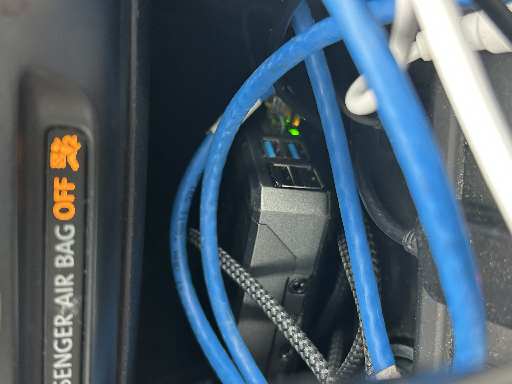
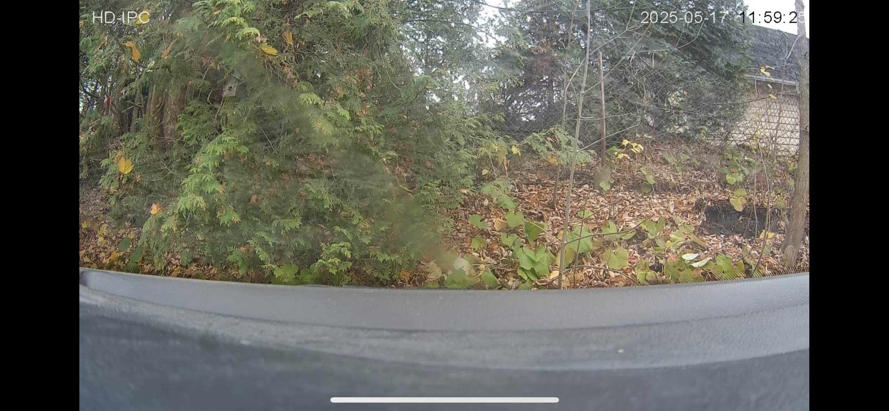
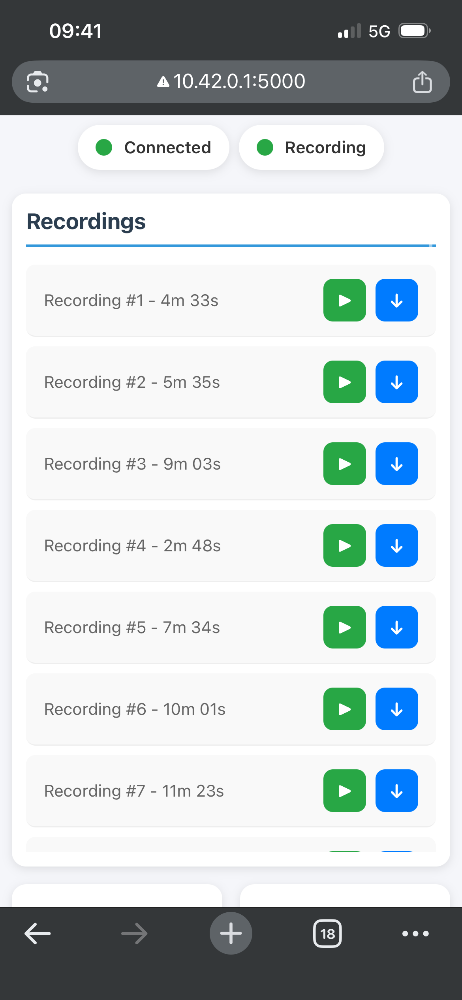

[↩ Retour à l’accueil](/index)

--------------------------------------------------------------------------------

# Dashcam

### Table des matières

- [Dashcam](#dashcam)

## Dashcam

Ayant vu beaucoup de vidéos en ligne de clips enregistrés sur une dashcam et comment ça peut être très utile en cas d'accident ou malchance autre, j'ai décidé de m'en construire une. J'avais une caméra IP qui trainait chez moi et je l'ai donc utilisé comme base pour ce projet.

Premièrement j'ai imprimé en 3D un case pour la caméra elle même et je l'ai monté sur le dash de ma voiture comme ci:

  

Ensuite, j'ai utilisé un raspberry pi 4 en ma possession que j'alimente en utilisante la prise cigarette et qui est connecté par ethernet à la caméra:

  

Finalement j'ai écris un script python qui enregistre la vidéo dès que la voiture est démarré et arrête lorsqu'elle s'éteint. Les clips ne sont jamais corrompus grâce à l'utilisation agile des options ffmpeg comme frag_keyframe, empty_moov et flush_packets. De plus, un serveur web est hosté localement sur un point d'accès créé par le Pi qui permet à n'importe qui de s'y connecter et voir tous les enregistrements récents. Voici un apperçu:

  

  

(voir code source [git](https://github.com/ChristopherLajoie/dashcam.git))

--------------------------------------------------------------------------------

[↩ Retour à l’accueil](/index)