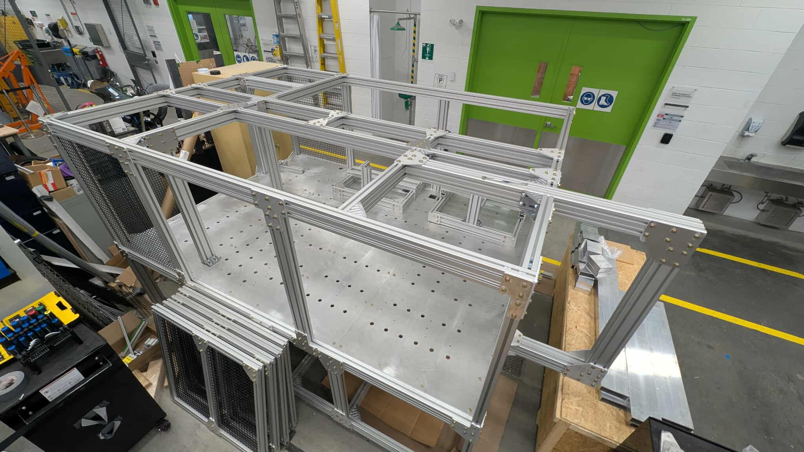

# Christopher Lajoie

- <christopher_lajoie@outlook.com>
- (514) 945-0436
- [linkedin](https://www.linkedin.com/in/christopherlajoiegenierobotique)
- [github](https://github.com/ChristopherLajoie)

## Projets et compétitions

- [Groupe technique Rovus – Robotique UdeS](robotique-udes/robotique-udes)
- [Projet majeur de conception - CapCarbone](pmc/pmc)

### [Groupe technique Rovus – Robotique UdeS](robotique-udes/robotique-udes)

  

--------------------------------------------------------------------------------

### [Projet majeur de conception - CapCarbone](pmc/pmc)

  

