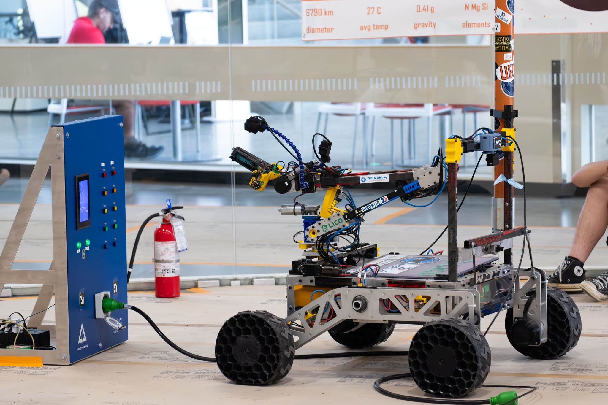
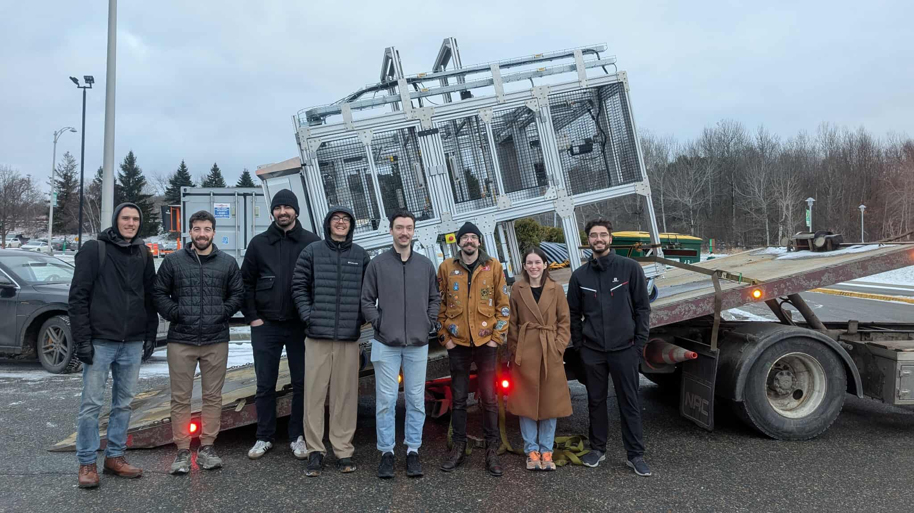
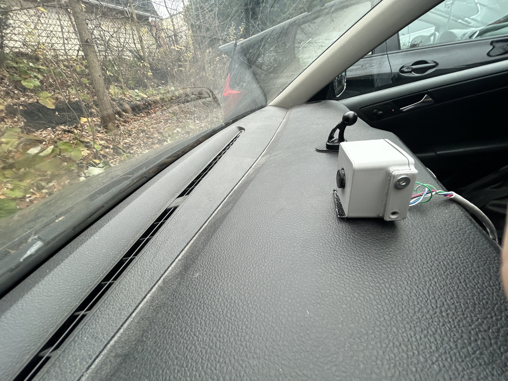

# Christopher Lajoie

- <christopher_lajoie@outlook.com>
- (514) 945-0436
- [linkedin](https://www.linkedin.com/in/christopherlajoiegenierobotique)
- [github](https://github.com/ChristopherLajoie)

## Bienvenue

Bienvenue dans mon portfolio! Voici quelques-uns de mes projets de conception en robotique. Ils ont été réalisés en grande partie en équipe, mais les éléments présentés représentent mes contributions personnelles. J’ai aussi d’autres réalisations décrites dans mes expériences de stage, disponibles sur ma page GitHub.

## Projets et compétitions

- [Groupe technique Rovus – Robotique UdeS](robotique-udes/robotique-udes)
- [Projet majeur de conception - CapCarbone](pmc/pmc)
- [Dashcam](dashcam/dashcam)

### [Groupe technique Rovus – Robotique UdeS](robotique-udes/robotique-udes)

  

--------------------------------------------------------------------------------

### [Projet majeur de conception - CapCarbone](pmc/pmc)

  

### [Dashcam](dashcam/dashcam)

  

