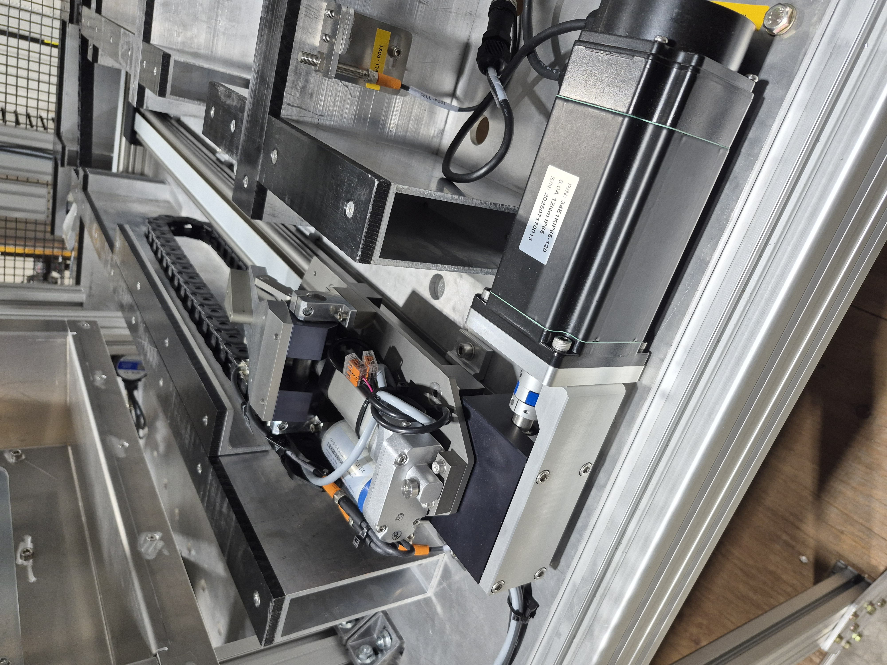
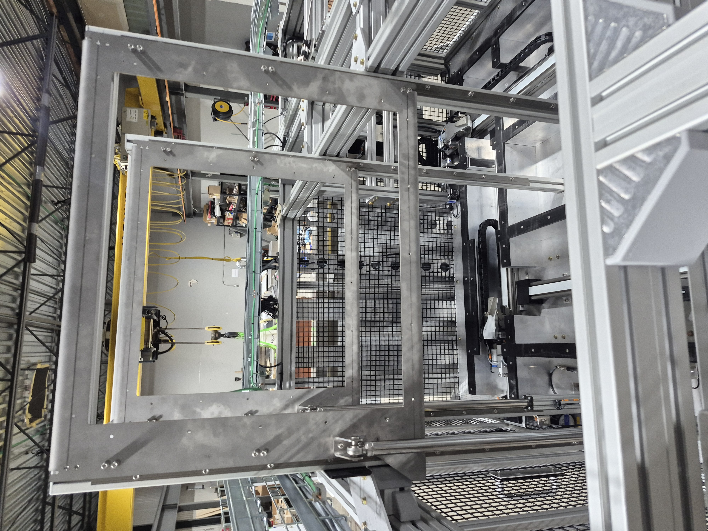

[↩ Retour à l’accueil](/index)

--------------------------------------------------------------------------------

# Projet majeur de conception - CapCarbone

### Table des matières

- [Projet majeur de conception](#projet-majeur-de-conception)
- [CapCarbone](#CapCarbone)
- [Rôle](#r%C3%B4le)
- [Galerie](#galerie)

## Projet majeur de conception

Le projet majeur de conception est un projet de fin d'étude s'étalant sur 3 sessions effectué à la fin du baccalauréat en génie robotique.

## CapCarbone

CapCarbone est un machine industrielle robuste et autonome de capture du carbone dans l'air partiellement financé et en collaboration avec l'entreprise Skyrenu pour le développement de leur technologie. 

  <video src="media/megagenial.mp4" controls style="max-width: 100%; height: auto;">
    Votre navigateur ne supporte pas la balise vidéo.
  </video>

## Rôle

J’ai occupé le rôle de responsable de la programmation PLC de la machine. Mes principales contributions jusqu’à présent sont :

- La conception et l'implémentation d'une architecture de controle des actuateurs de la machine sous TwinCAT3
- La conception et l'implémentation d'un système de gestion des alarmes de la machine connecté avec Ignition
- Contribution à la conception d'une interface humain-machine (HMI) 
- Etc.

(voir code source [PLC](https://github.com/ChristopherLajoie/PMC_CapCarbone))

## Galerie

  

  

  

  

  

  

  

  

  

--------------------------------------------------------------------------------

[↩ Retour à l’accueil](/index)