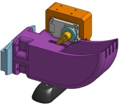
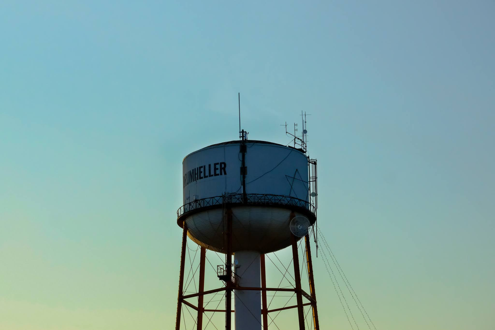

[↩ Retour à l’accueil](/index)

--------------------------------------------------------------------------------

# Robotique UdeS – Rovus

### Table des matières

- [Résultats](#r%C3%A9sultats)
- [Réalisations 2023](#r%C3%A9alisations-2023)
- [Réalisations 2024-2025](#r%C3%A9alisations-2024)
- [Galerie](#galerie)

## Rovus

Depuis 2023, je fais partie du groupe technique Rovus au sein de Robotique UdeS, où l'équipe conçoit un rover martien destiné à la compétition [*CIRC*](https://circ.cstag.ca/2024/) en Alberta. Je m’y implique depuis maintenant trois ans.

  

## Résultats

- CIRC 2024 : 147 points → 5e place internationale, 2e place canadienne  
- CRQRC 2024 (Compétition québecoise de Rover) : 1re place 
- CIRC 2023 : 154 points → 5e place internationale, 2e place canadienne

## Réalisations 2023

Pour l’édition 2023, j’étais responsable du module science. Voici quelques tâches que j’ai effectuées :

- Conception d'un assemblage mécanique pour faire monter et descendre la station de récolte, creuser et récolter des échantillons de terre et trier les échantillons automatiquement.
- Impression 3D/prototypage de plusieurs designs.
- Choix de moteurs pour l'assemblage.
- Programmation embarquée des pelles de l'assemblage

  
  

## Réalisations 2024-2025

Pour l’édition 2024 et 2025, j'ai travaillé sur l'ordinateur de bord et le GUI :

### Ordinateur de bord

Cette partie a fait appel à mes connaissances de construction d’ordinateur qui est une de mes passions. L’idée ici était de miniaturiser l’ordinateur le plus possible tout en gardant une plateforme custom qui permet d’améliorer l’ordinateur plus tard. J’ai donc fait la sélection des pièces nécessaires, l’assemblage, la conception de l’enclosure ainsi que la configuration.

  

### Programmation  

Après l’achat des nouvelles caméras embarquées, j’ai construit un API python qui permet de changer les différents paramètres de la caméra à tout moment. Cela état important pour le contrôle du rover puisque la seule autre façon de les changer était d’accéder à une application Windows tandis que tout le logiciel embarqué du rover est sur Linux. Cet API a été utilisé dans les compétitions suivantes et a permis le bon fonctionnement des caméras dans toutes les conditions d’opération possible.

J’ai ensuite pivoté vers mon travail sur le GUI. Les caméras IP diffusent leur vidéo par un stream RTSP et celui-ci devait être implémenté dans le UI du rover qui est construit avec la plateforme Qt6 en C++. J’ai donc découvert et utilisé l’outils GStreamer ainsi que Qt6 pour implémenter cette nouvelle feature

(voir code source [ROS](https://github.com/robotique-udes/rover))

## Galerie

--------------------------------------------------------------------------------

[↩ Retour à l’accueil](/index)